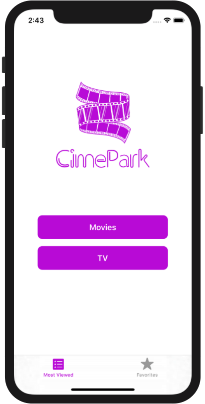
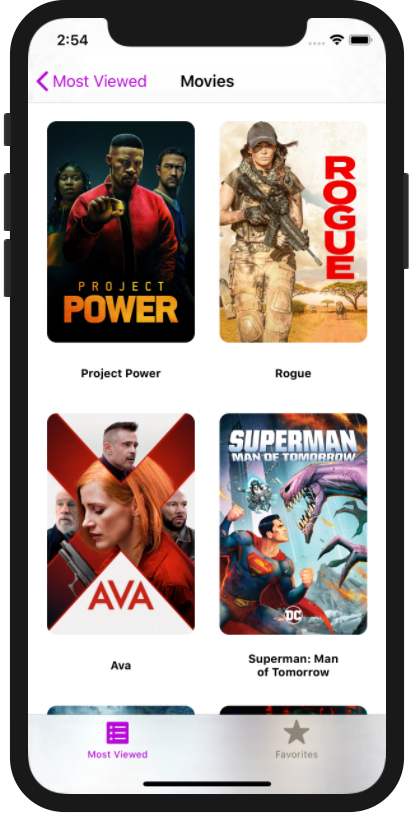
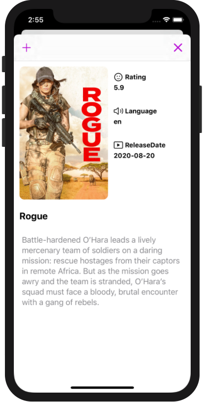
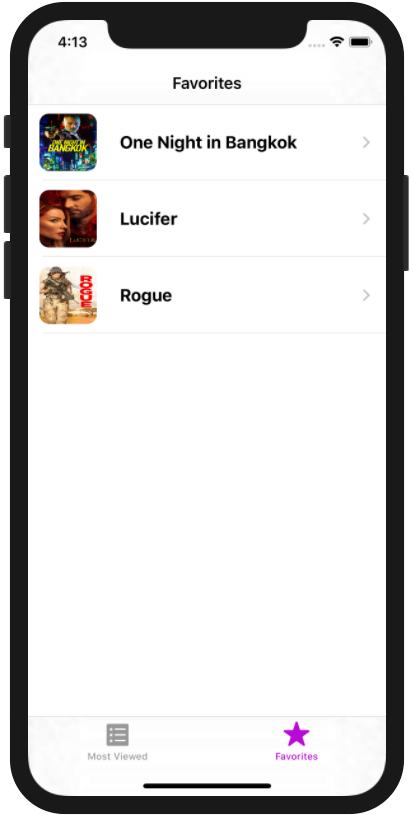

# CinePark

This is a sample ap that utilizes The Movie Database (TMDb) free API to show most popular movies and TV series.

 - Upon launch, the app presents the user with two options.
 - Allow the user to search movies and TV.
 - Allow the user to save movie into favorites.
 - Allow the user to tap on a movie poster and transition to a details screen with additional information such as:
   - original title
   - movie poster image - background poster
   - A plot synopsis
   - user rating (called vote_average in the api)
   - release date
   - original language
   
## Project Features

- Story Board is deleted and the app is built entirely using programmatic UI with Swift. 
- Most components are re-used throught the project with minimum code duplication.
- Uses caching for poster images.
- Utilizes UITableViewDiffableDataSource for items grid and for handling search animation.
- Designed to fully support dark mode. 
- Uses a networking layer built on top of Alamofire and RxSwift.
- Works on all screen sizes from iPhone SE to iPad pro.


## Installation
- The movie information uses [The Movie Database (TMDb)](https://www.themoviedb.org/documentation/api) API.
To make your app work, you have to enter your own API key into `NetworkingConstants` class file.

```NetworkingConstants
static let apiKey = "Bearer API_KEY" 
```

- 3rd party libraries are not included in the repository, you will need to run `pod install` to have a successful build.


## App Media

|  | |  |  |
|:---:|:---:|:---:|:---:|
| |  |  |  |

